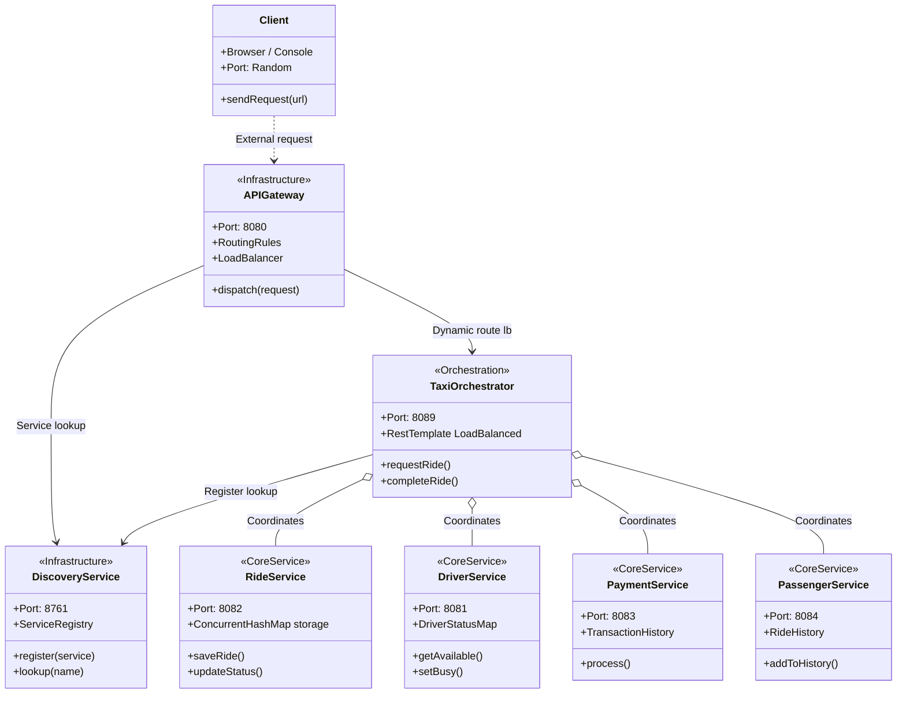

```mermaid
classDiagram
    
    class Client {
        +Browser / Console
        +Port: Random
        +sendRequest(url)
    }

    class DiscoveryService {
        <<Infrastructure>>
        +Port: 8761
        +ServiceRegistry
        +register(service)
        +lookup(name)
    }

    class APIGateway {
        <<Infrastructure>>
        +Port: 8080
        +RoutingRules
        +LoadBalancer
        +dispatch(request)
    }

    class TaxiOrchestrator {
        <<Orchestration>>
        +Port: 8089
        +RestTemplate LoadBalanced
        +requestRide()
        +completeRide()
    }

    class RideService {
        <<CoreService>>
        +Port: 8082
        +ConcurrentHashMap storage
        +saveRide()
        +updateStatus()
    }

    class DriverService {
        <<CoreService>>
        +Port: 8081
        +DriverStatusMap
        +getAvailable()
        +setBusy()
    }

    class PaymentService {
        <<CoreService>>
        +Port: 8083
        +TransactionHistory
        +process()
    }

    class PassengerService {
        <<CoreService>>
        +Port: 8084
        +RideHistory
        +addToHistory()
    }

    %% Relationships
    Client ..> APIGateway : External request
    APIGateway --> DiscoveryService : Service lookup
    APIGateway --> TaxiOrchestrator : Dynamic route lb
    TaxiOrchestrator --> DiscoveryService : Register lookup

    TaxiOrchestrator o-- RideService : Coordinates
    TaxiOrchestrator o-- DriverService : Coordinates
    TaxiOrchestrator o-- PaymentService : Coordinates
    TaxiOrchestrator o-- PassengerService : Coordinates
```
