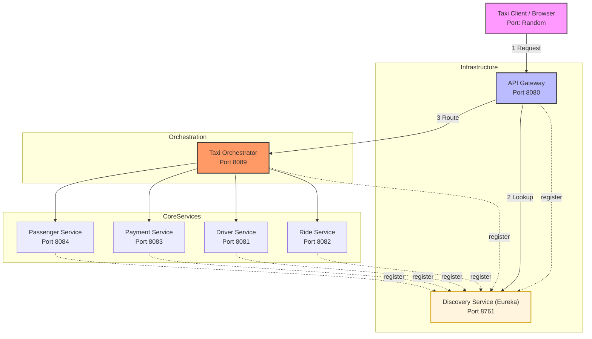

```mermaid
graph TD

    Client["Taxi Client / Browser\nPort: Random"]

    subgraph Infrastructure
        Eureka["Discovery Service (Eureka)\nPort 8761"]
        Gateway["API Gateway\nPort 8080"]
    end

    subgraph Orchestration
        Orch["Taxi Orchestrator\nPort 8089"]
    end

    subgraph CoreServices
        RideMS["Ride Service\nPort 8082"]
        DriverMS["Driver Service\nPort 8081"]
        PayMS["Payment Service\nPort 8083"]
        PassMS["Passenger Service\nPort 8084"]
    end

    Gateway -. register .-> Eureka
    Orch -. register .-> Eureka
    RideMS -. register .-> Eureka
    DriverMS -. register .-> Eureka
    PayMS -. register .-> Eureka
    PassMS -. register .-> Eureka

    Client -->|1 Request| Gateway
    Gateway -->|2 Lookup| Eureka
    Gateway -->|3 Route| Orch

    Orch --> RideMS
    Orch --> DriverMS
    Orch --> PayMS
    Orch --> PassMS

    style Client fill:#f9f,stroke:#333,stroke-width:2px
    style Eureka fill:#fff4dd,stroke:#d4a017,stroke-width:2px
    style Gateway fill:#bbf,stroke:#333,stroke-width:2px
    style Orch fill:#f96,stroke:#333,stroke-width:2px
```
