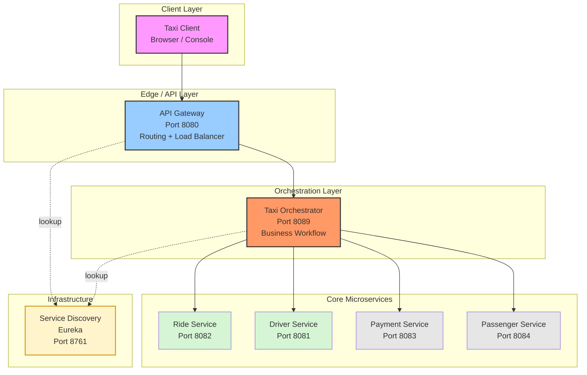

```mermaid
flowchart TB

%% CLIENT LAYER
subgraph ClientLayer["Client Layer"]
    Client["Taxi Client\nBrowser / Console"]
end

%% EDGE LAYER
subgraph EdgeLayer["Edge / API Layer"]
    Gateway["API Gateway\nPort 8080\nRouting + Load Balancer"]
end

%% ORCHESTRATION
subgraph OrchestrationLayer["Orchestration Layer"]
    Orch["Taxi Orchestrator\nPort 8089\nBusiness Workflow"]
end

%% MICROSERVICES
subgraph MicroservicesLayer["Core Microservices"]
    Ride["Ride Service\nPort 8082"]
    Driver["Driver Service\nPort 8081"]
    Payment["Payment Service\nPort 8083"]
    Passenger["Passenger Service\nPort 8084"]
end

%% INFRASTRUCTURE
subgraph InfrastructureLayer["Infrastructure"]
    Eureka["Service Discovery\nEureka\nPort 8761"]
end

%% REQUEST FLOW
Client --> Gateway
Gateway --> Orch

%% SERVICE DISCOVERY
Gateway -. lookup .-> Eureka
Orch -. lookup .-> Eureka

%% BUSINESS CALLS
Orch --> Ride
Orch --> Driver
Orch --> Payment
Orch --> Passenger

%% STYLES
style Client fill:#f9f,stroke:#333,stroke-width:2px
style Gateway fill:#9cf,stroke:#333,stroke-width:2px
style Orch fill:#f96,stroke:#333,stroke-width:2px

style Ride fill:#d5f5d5
style Driver fill:#d5f5d5
style Payment fill:#e6e6e6
style Passenger fill:#e6e6e6

style Eureka fill:#fff4cc,stroke:#d4a017,stroke-width:2px
```
